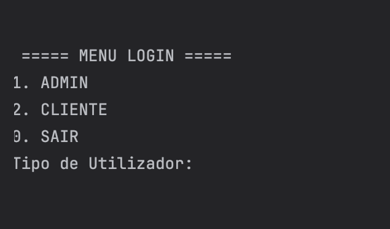
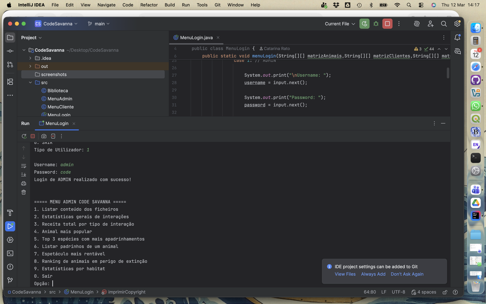
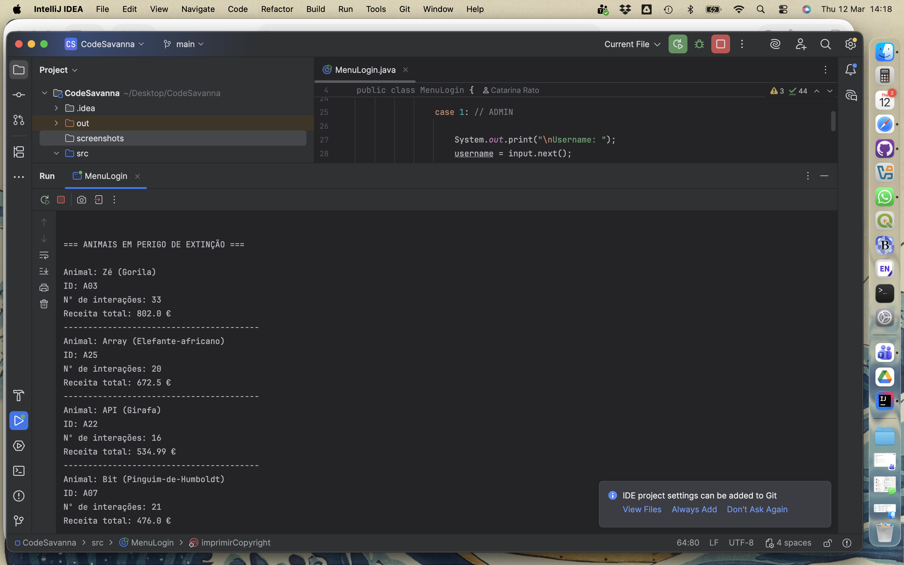
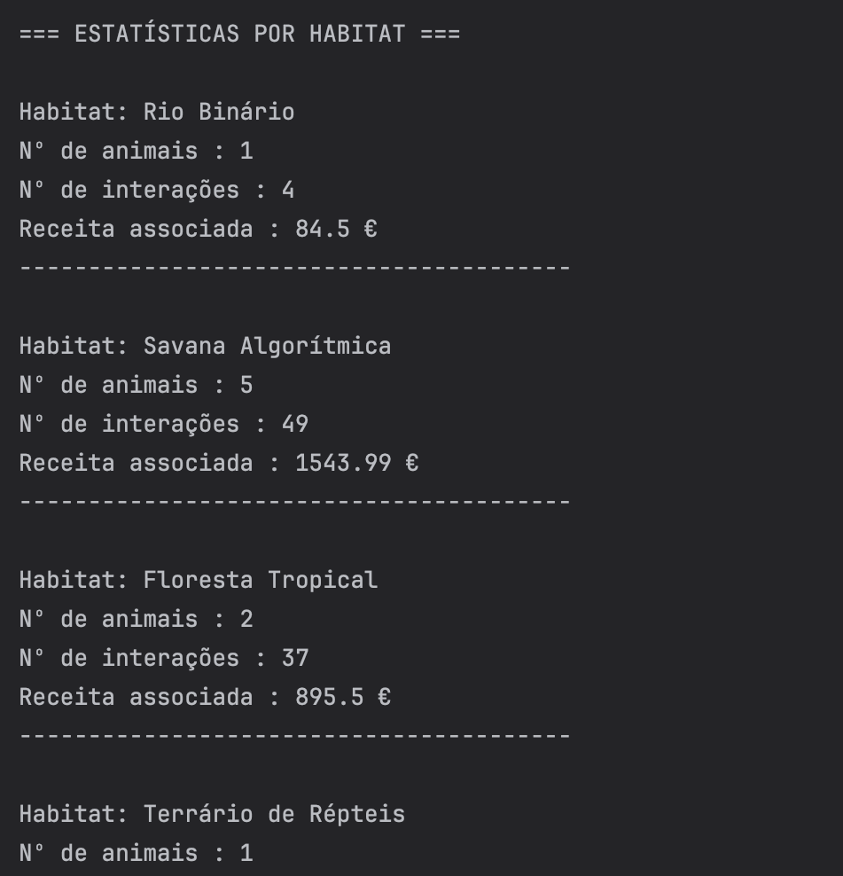

# 🦁 Code Savanna


**Code Savanna** is a **Java console application** that simulates the management of an interactive zoo.

The system stores and processes information about **animals, customers, and zoo interactions** using **CSV files**, allowing data to be organised and analysed in a simple and functional way.

Through a **menu-driven console interface**, users can explore zoo data, analyse statistics, simulate animal sponsorships, and even play a small mini-game.

This project was developed as part of a **Structured Programming course**, combining programming logic with a creative and engaging theme.

---

# 🖼️ Application Preview

<p align="center">
  
  
  
  
</p>

---

# 👥 User Profiles

The application supports two different user roles.

## 🔐 Administrator

Administrators can manage and analyse the zoo data through several features:

- Browse and inspect data files  
- View general statistics  
- Calculate revenue by interaction type  
- Identify the most popular animal  
- Discover the species with the most sponsorships  
- List all animal sponsors  
- Find the most profitable show  
- Filter information by **habitat** or **extinction risk level**

---

## 🧭 Customer

Customers can interact with the system through a more exploratory experience:

- Explore the **animal catalogue** filtered by habitat  
- View activities available for each animal  
- Simulate **animal sponsorships**  
- Play a fun **species guessing mini-game**

---

# ✨ Features

- 🦓 Interactive zoo management simulation  
- 📊 Data analysis based on CSV datasets  
- 📂 File reading and processing  
- 📋 Console-based interactive menus  
- 🎮 Mini-game for species guessing  
- 📈 Statistics and revenue calculations  
- 🐾 Animal catalogue exploration  

---

# 🛠 Technologies Used

| Technology | Purpose |
|------------|--------|
| **Java** | Core application logic |
| **CSV files** | Data storage |
| **Console I/O** | Interactive interface |

---

# 🎓 Academic Context

This project was developed to practice and demonstrate several **core programming concepts**, including:

- File reading and parsing  
- Multi-dimensional arrays (matrices)  
- Interactive menus and user input handling  
- Conditional logic and loops  
- Modular program organisation  

The project combines **data processing, structured programming techniques, and an engaging simulation theme**.

---

# 🚀 Running the Project

### Compile the project

```bash
javac -d out $(find src -name '*.java')
```

### Run the application

```bash
java -cp out Main
```

---

# 👩‍💻 Author

**Catarina Rato**

Academic project developed for **Structured Programming** practice using Java.
